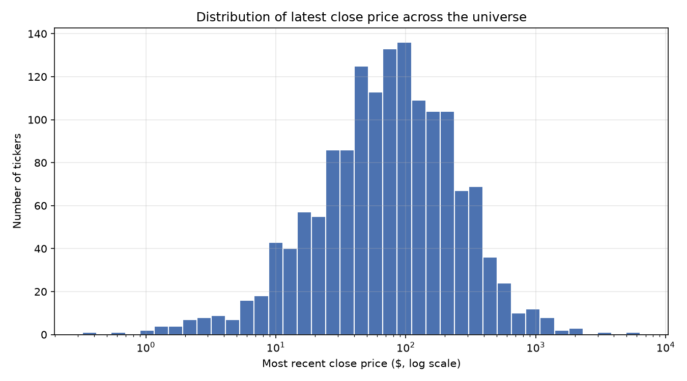
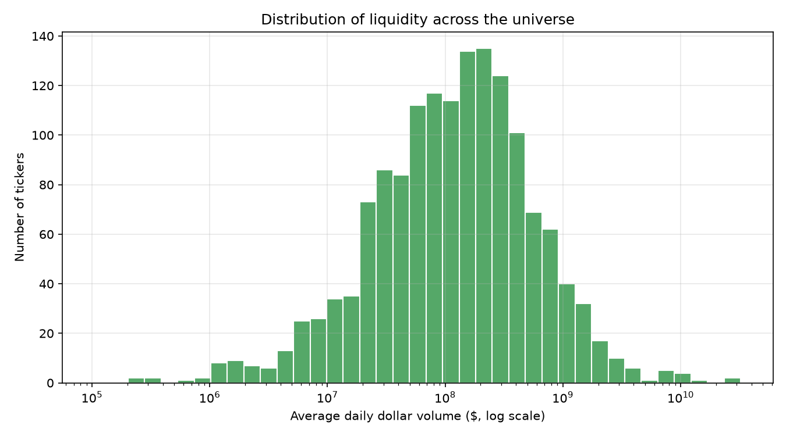
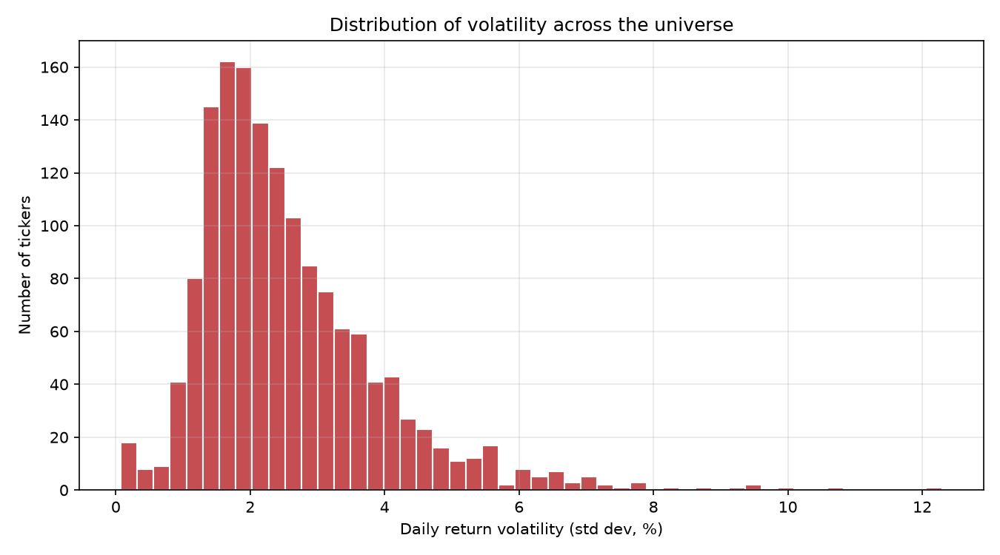
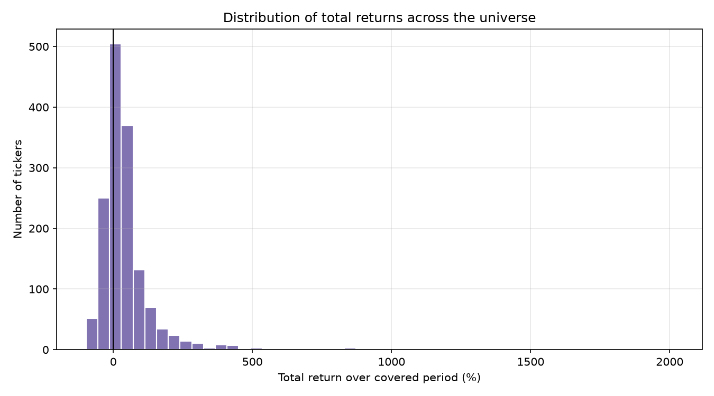
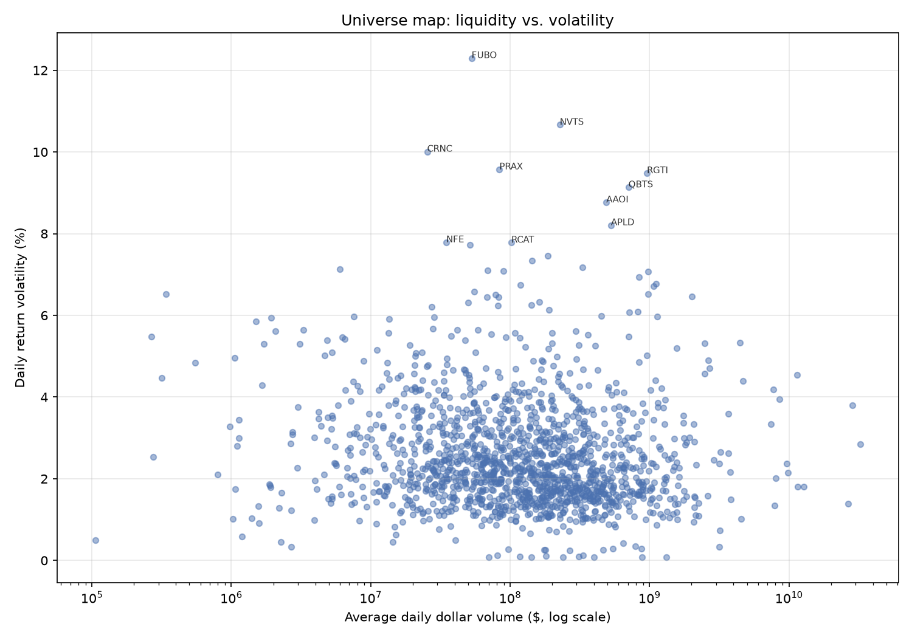
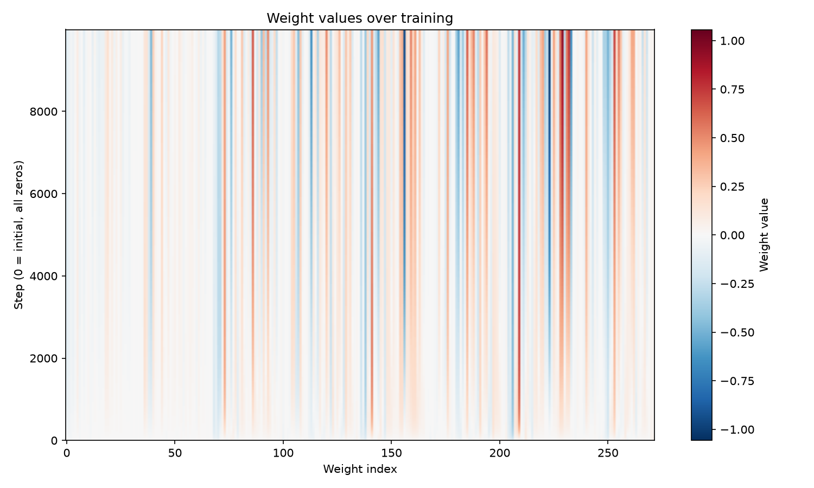

# The Stock Prediction Model behind [predictions.byebility.com](https://predictions.byebility.com)

*Stock return forecasting — trained from scratch on self-scraped stock
 universe.*

> Data pulled by a self-written scraper. Every stage of the model (features, universe-wide pretraining, per-ticker fine-tuning)  is implemented in raw C, with zero ML libraries.

## Overview

- Market reference: SPY
- 68 features per sample
- 4 independent forecasting outputs (1/5/10/20 day returns)
- Weights are pretrained across the entire company universe, then fine-tuned and calibrated per ticker before each forecast
- Data collected and validated by a self-written scraper, not a downloaded dataset

## Mathematics Behind The Features Calculation

Note: daily log return $r_s=\ln(C_s/C_{s-1})$, window $W_L(t)=\{t-L+1,\dots,t\}$ with $L\in\{5,10,20\}$ (for my horizons), $S$ = stock, $M$ = market.

**Volatility** — standard deviation of returns:

$$\sqrt{\frac{1}{L}\sum\big(r_s-\bar r_L\big)^2}$$

**Dispersion** — standard deviation of closes:

$$\sqrt{\frac{1}{L}\sum\big(C_s-\bar C_L\big)^2}$$

**Stability** — RMS of the change in returns:

$$\sqrt{\frac{1}{L-1}\sum\big(r_s-r_{s-1}\big)^2}$$

**Persistence** — lag-1 Pearson autocorrelation:

$$\frac{\frac{1}{L-1}\sum\big(r_s-\bar X\big)\big(r_{s+1}-\bar Y\big)}{\sigma_X\,\sigma_Y}$$

**Relative volatility** — stock returns dispersed around the *market's* mean return:

$$\sqrt{\frac{1}{L}\sum\big(r-\bar r\big)^2}$$

**Market correlation** — Pearson between stock and market returns:

$$\frac{\frac{1}{L}\sum\big(r_s-\bar r_s\big)\big(r_m-\bar r_m\big)}{\sigma_s\,\sigma_m}$$


## Horizons

- 1 day
- 5 days
- 10 days
- 20 days

## Training universe

Daily bars per ticker — `v`, `vw`, `o`, `c`, `h`, `l`, `t`, `n` (volume, VWAP, open, close, high, low, timestamp, transaction count) — are pulled by a self-written scraper against a market-data aggregates API: one JSON file per company, plus a single SPY file used as the market reference.

Every sample is validated on load — any non-positive field (a halted day, a bad tick) triggers a warning instead of silently entering training. Company files used for pretraining are also required to hold exactly 501 rows before they're accepted to ensure alignment with the universe's timeframe.


*Spread of price levels across the universe.*


*Spread of average daily dollar volume*


*Spread of daily return volatility across tickers.*


*Total return over the covered period, across the universe.*


*A map of the whole training universe: how liquid vs. how volatile each name is.*

## Features

68 features per sample — computed for both the stock and the market (SPY) at 5/10/20-day lookbacks, plus same-day price action:

- **Momentum** — log return over the lookback window
- **Relative volume** — today's volume vs. its rolling average
- **Volatility** — standard deviation of daily log returns
- **Dispersion** — how spread out the price path is around its own mean
- **Stability** — how much day-to-day *changes* in returns fluctuate
- **Persistence** — autocorrelation of returns (continuation vs. reversion)
- **Gap, intraday move, range, closing strength** — same-day price action
- **Relative VWAP, relative transaction count, average trade-size slope**
- **Stock vs. market** — return volatility and return correlation relative to SPY

All of it — rolling sums, standard deviations, Pearson correlation — is implemented by hand in C over raw `double` arrays. No stats library involved.

## Model

```text
prediction = w · x + b
target     = ln(C[t+h] / C[t])
future_price = current_price × exp(prediction)
```

Each horizon is an independent linear regression on log-returns. All 4 heads share the same 68 input features:

| Horizon | Look-ahead | Weight slice | Bias index |
|---|---|---|---|
| 1 day  | `t + 1`  | `weights[0:68]`    | `bias[0]` |
| 5 day  | `t + 5`  | `weights[68:136]`  | `bias[1]` |
| 10 day | `t + 10` | `weights[136:204]` | `bias[2]` |
| 20 day | `t + 20` | `weights[204:272]` | `bias[3]` |

272 weights + 4 biases — 276 learned parameters. The same 276 parameters flow through both training stages below: first fit across the whole universe, then finetune to one company at a time.

## Training

Training happens in two stages, using two separate C libraries.

### Stage 1 — Cross-sectional pretraining (`training.c`)

Walks forward through calendar time across the *entire* company universe at once:

1. At each trading day, compute the prediction error for every company in the universe and average the gradient across all of them — a full batch over the cross-section, not a sampled subset.
2. After a full walk through the available history, recompute RMSE on all 4 horizons. If every horizon got strictly worse, half the learning rate, otherwise repeat.


Weights are checkpointed to `model_weights` as a flat, underscore-delimited text file.


*All 272 weights over time — the four horizon blocks (68 weights each) show up as distinct vertical bands.*

### Stage 2 — Per-ticker fine-tuning & calibration (`model.c`)

Every time a forecast is requested for a ticker, the pretrained weights are adapted specifically to that company before predicting:

1. Load the shared, pretrained weights from Stage 1.
2. Fine-tune them against *only* this ticker's own history — one gradient step per day, for 100 epochs (`EPOCHS`), with the same adaptive learning-rate halving watching all 4 horizons.
3. Walk the ticker's full history once more to calibrate: the average residual (expected − predicted) becomes a per-horizon **bias correction**, and the spread of the *debiased* residuals becomes that horizon's **sd**.
4. Predict on the most recent closed day, apply the bias correction, and express confidence as a residual-normalized score — how far the forecast sits from that ticker's own typical noise.

If the most recent bar in the data belongs to today's still-open session, it's excluded from both fine-tuning and calibration, so the model never trains or predicts off a candle that hasn't closed yet.

## Output

For a given ticker and date, each of the 4 horizons returns:

- **Expected return** — the fine-tuned prediction, debiased against the ticker's own historical residuals
- **Expected price** — starting price × exp(expected return)
- **Starting price** — the close the forecast is anchored to
- **Residual bias** — the ticker's average historical miss for this horizon
- **Residual standard deviation** — the spread of residuals after the bias correction
- **Forecast strength** — expected return ÷ residual sd, a z-score of how unusual this forecast is relative to the ticker's own noise

## Roadmap

- Chronological train/test split for both stages — RMSE and the bias/sd calibration are currently measured over the same window used to fit them, but before finetuning, so they are worse case maximal values.
- Walk-forward validation across multiple time windows, for both the universe pretrain and the per-ticker fine-tune.
- Regularization, given 276 parameters fit against a relatively short per-ticker history during Stage 2.

## Stack

- **C** — features, both training stages, and calibration (`training.c` / `training.h`, `model.c` / `model.h`)
- **Python** — scraping, JSON parsing, and the `ctypes` bridge into the compiled C libraries (`training.py`, `model.py`)

No ML framework and no numerical library anywhere in the loop — every gradient and every rolling statistic is hand-written.

## Project layout

```text
└── QuantitativeMarketPrediction
    ├── LICENSE
    ├── README.md
    ├── model
    │   ├── Makefile
    │   ├── features.c
    │   ├── finetuning
    │   │   └── finetune.c
    │   ├── general_training
    │   │   ├── get_data.py
    │   │   ├── model_weights
    │   │   ├── training.c
    │   │   ├── training.h
    │   │   └── training.py
    │   ├── model_weights
    │   ├── parse_data.py
    │   ├── prediction
    │   │   └── predict.c
    │   ├── src
    │   │   └── model.c
    │   └── utils
    │       ├── global.c
    │       ├── utils.c
    │       └── utils.h
    └── plots
        ├── *
```